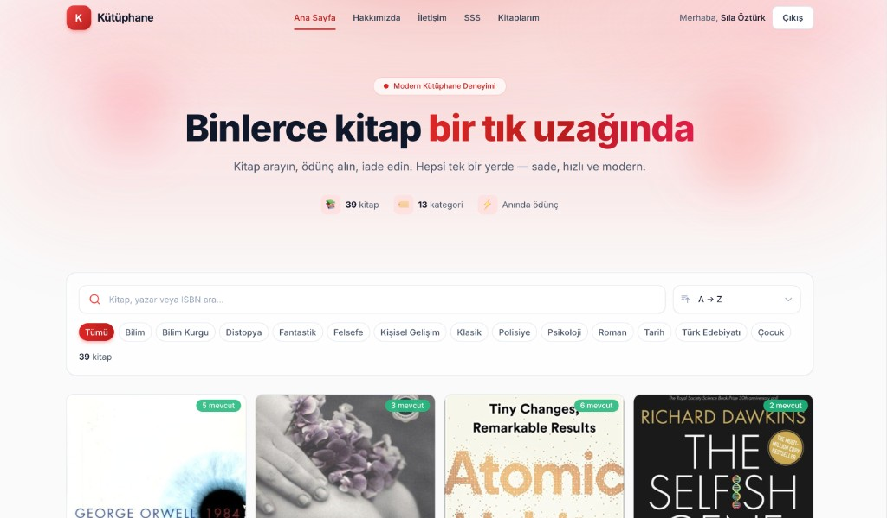
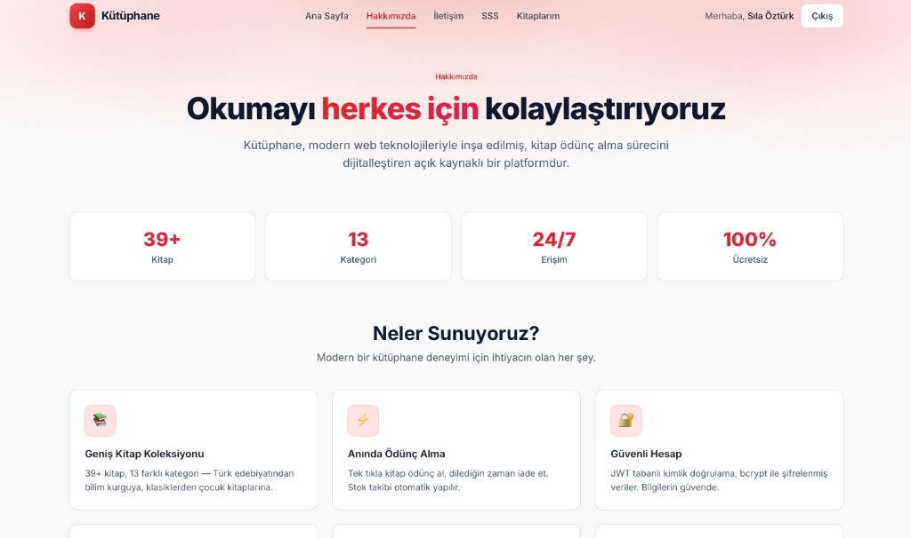
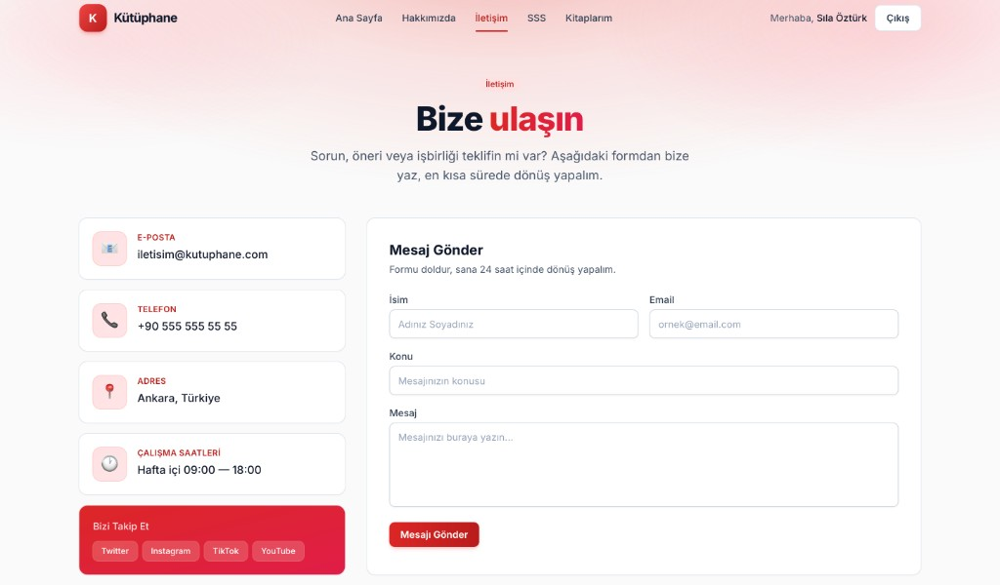
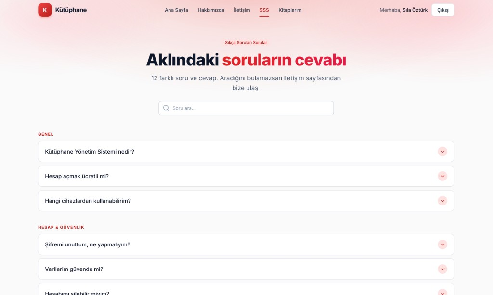
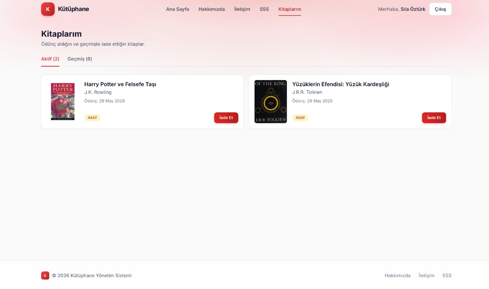
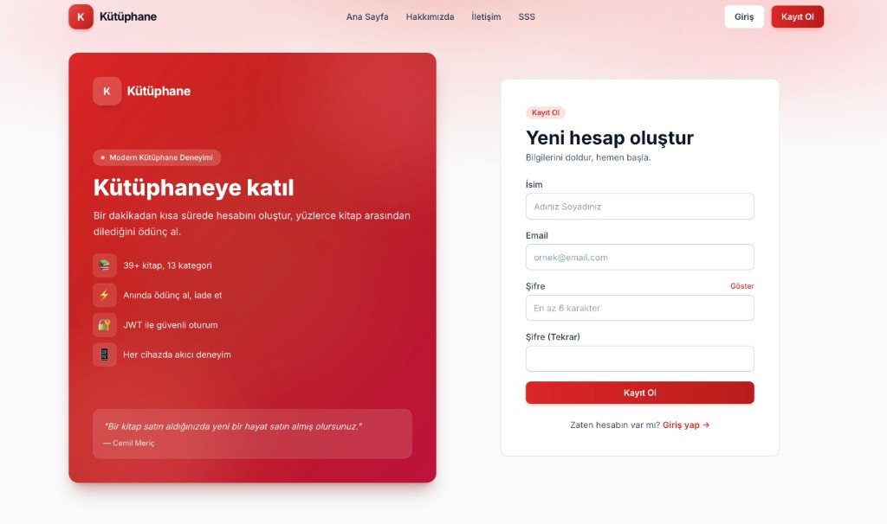

# Kütüphane Yönetim Sistemi

> Modern web teknolojileriyle geliştirilmiş, **MERN Stack** tabanlı tam fonksiyonlu bir kütüphane yönetim uygulaması.

Kullanıcılar kitap arar, kategoriye göre filtreler, ödünç alır ve iade eder. Yöneticiler ise kitapları, ödünç kayıtlarını ve kullanıcıdan gelen iletişim mesajlarını tek bir panelden yönetir.

---

<a id="genel-bakis"></a>
## Genel Bakış

Bu proje, bir kütüphanenin kitap envanteri ile ödünç alma süreçlerini dijitalleştiren, **rol tabanlı erişim** içeren bir web uygulamasıdır.

İki ana kullanıcı rolü vardır:

- **User (Üye)**: Kitapları görüntüler, arar, filtreler, ödünç alır ve iade eder. Aynı anda en fazla **2 aktif** ödünç hakkı vardır.
- **Admin**: Tüm kullanıcı yetkilerine sahiptir; ek olarak kitap ekler/günceller/siler, ödünç kayıtlarının tamamını görür ve iletişim formundan gelen mesajları yönetir. Admin için ödünç limiti yoktur.

---

<a id="ekran-goruntuleri"></a>

## Ekran Görüntüleri

### Anasayfa

Hero bölümü, arama çubuğu, kategori chip'leri, sıralama menüsü ve kitap grid'i.



### Hakkımızda

Misyon, istatistik kartları ve özellik vitrini.



### İletişim

Bilgi kartları, sosyal medya linkleri ve gerçek backend'e bağlı iletişim formu.



### Sıkça Sorulan Sorular

Aranabilir akordeon arayüzü.



### Kitaplarım

Kullanıcının aktif ve geçmiş ödünç kayıtları, sekmeli görünüm.



### Kayıt Ol

Split-screen tasarım — solda branded yan panel, sağda form.



---

<a id="kullanilan-teknolojiler"></a>

## Kullanılan Teknolojiler

### Frontend

| Teknoloji          | Açıklama                                          |
| ------------------ | ------------------------------------------------- |
| **React 18**       | Bileşen tabanlı UI kütüphanesi                    |
| **Vite**           | Hızlı geliştirme sunucusu ve build aracı          |
| **React Router**   | Tek sayfa uygulama (SPA) yönlendirmesi            |
| **Tailwind CSS**   | Utility-first CSS framework + özel `brand` paleti |
| **Axios**          | HTTP istekleri (interceptor ile JWT yönetimi)     |
| **Context API**    | Global durum yönetimi (Auth, Borrow Limit)        |
| **React Toastify** | Bildirim sistemi                                  |

### Backend

| Teknoloji                 | Açıklama                                |
| ------------------------- | --------------------------------------- |
| **Node.js + Express**     | RESTful API sunucusu                    |
| **MongoDB Atlas**         | Bulut tabanlı NoSQL veritabanı          |
| **Mongoose**              | MongoDB için ODM (şema doğrulama)       |
| **JWT (jsonwebtoken)**    | Token tabanlı kimlik doğrulama          |
| **bcryptjs**              | Şifre hashleme                          |
| **express-async-handler** | Async route'larda hata yönetimi         |
| **CORS, dotenv**          | Cross-origin desteği ve env yönetimi    |

---

<a id="ozellikler"></a>

## Özellikler

### Kullanıcı Tarafı

- Kayıt olma ve giriş yapma (form validasyonu, şifre gücü göstergesi)
- Anasayfada kitap **arama** (başlık / yazar / ISBN)
- **Kategori chip'leri** ile filtreleme
- **Sıralama** (A→Z, Z→A, En Çok Mevcut)
- Kitap detay sayfası (stok durumu kartı + ilerleme çubuğu)
- Ödünç alma (en fazla 2 aktif ödünç limiti, anlık uyarı)
- "Kitaplarım" sayfasında aktif ve geçmiş ödünç kayıtları
- İade etme

### Admin Paneli

- Yönetici özet istatistikleri (toplam kitap, kopya, müsait, aktif ödünç)
- Kitap **CRUD** işlemleri (modal üzerinden)
- Tüm ödünç kayıtlarını görüntüleme (kullanıcı + kitap bilgisi ile)
- İletişim formundan gelen **mesaj yönetimi** (okundu/okunmadı, sil, mailto: yanıtla, okunmamış sayacı badge)

### Diğer Sayfalar

- **Hakkımızda**: Misyon, vizyon, istatistikler, özellikler
- **İletişim**: Bilgi kartları + sosyal medya + gerçek API'ye bağlı form
- **SSS**: Aranabilir akordeon arayüzü

### Güvenlik & UX

- JWT token + Authorization header
- 401 yanıtında otomatik logout ve `/login` yönlendirmesi
- `ProtectedRoute` ile rol bazlı sayfa koruması
- Şifrelerin bcrypt ile hashlenerek saklanması
- Form validasyonları (frontend + Mongoose schema seviyesinde)
- Loading spinner'ları, toast bildirimleri, boş durum (empty state) tasarımları
- Tamamen **responsive** (mobil + tablet + masaüstü)

---

<a id="mimari-ve-klasor-yapisi"></a>

## Mimari ve Klasör Yapısı

```
web-programlama-proje/
├── backend/
│   ├── config/
│   │   └── db.js                    # MongoDB Atlas bağlantısı
│   ├── controllers/
│   │   ├── authController.js        # Kayıt, giriş, profil
│   │   ├── bookController.js        # Kitap CRUD
│   │   ├── borrowController.js      # Ödünç alma/iade + limit
│   │   └── messageController.js     # İletişim mesajları
│   ├── middleware/
│   │   ├── authMiddleware.js        # protect (JWT doğrulama)
│   │   ├── roleMiddleware.js        # adminOnly
│   │   └── errorMiddleware.js       # Global hata yakalayıcı
│   ├── models/
│   │   ├── User.js
│   │   ├── Book.js
│   │   ├── Borrow.js
│   │   └── Message.js
│   ├── routes/
│   │   ├── authRoutes.js
│   │   ├── bookRoutes.js
│   │   ├── borrowRoutes.js
│   │   └── messageRoutes.js
│   ├── utils/
│   │   ├── generateToken.js
│   │   └── seed.js                  # Test verilerini yükle
│   ├── .env                         # MONGO_URI, JWT_SECRET, PORT
│   └── server.js
│
└── frontend/
    ├── src/
    │   ├── api/
    │   │   └── axios.js             # JWT interceptor
    │   ├── components/
    │   │   ├── Navbar.jsx           # Scroll-trigger transparan header
    │   │   ├── Footer.jsx
    │   │   ├── BookCard.jsx
    │   │   ├── SearchBar.jsx        # Arama + chip + sıralama
    │   │   ├── Modal.jsx
    │   │   ├── LoadingSpinner.jsx
    │   │   ├── ProtectedRoute.jsx
    │   │   ├── AuthSidePanel.jsx    # Giriş/Kayıt yan paneli
    │   │   └── Accordion.jsx
    │   ├── context/
    │   │   └── AuthContext.jsx      # User + token + borrowLimit
    │   ├── pages/
    │   │   ├── Home.jsx
    │   │   ├── BookDetail.jsx
    │   │   ├── Login.jsx
    │   │   ├── Register.jsx
    │   │   ├── MyBooks.jsx
    │   │   ├── AdminDashboard.jsx
    │   │   ├── About.jsx
    │   │   ├── Contact.jsx
    │   │   └── Faq.jsx
    │   ├── App.jsx
    │   └── index.css                # Tailwind + custom layer
    ├── tailwind.config.js           # brand (kırmızı) paleti
    ├── vite.config.js               # /api → :5001 proxy
    └── index.html
```

---

<a id="veri-modelleri"></a>

## Veri Modelleri

### User

| Alan       | Tip      | Notlar                                            |
| ---------- | -------- | ------------------------------------------------- |
| `name`     | String   | Zorunlu                                           |
| `email`    | String   | Zorunlu, benzersiz, lowercase                     |
| `password` | String   | bcrypt ile hashlenir (`pre('save')` hook)         |
| `role`     | String   | `user` veya `admin` (varsayılan: `user`)          |

### Book

| Alan              | Tip    | Notlar                                |
| ----------------- | ------ | ------------------------------------- |
| `title`           | String | Zorunlu                               |
| `author`          | String | Zorunlu                               |
| `category`        | String | İndekslenmiş                          |
| `isbn`            | String | Benzersiz                             |
| `description`     | String | Açıklama metni                        |
| `coverImage`      | String | URL                                   |
| `totalCopies`     | Number | Toplam kopya sayısı                   |
| `availableCopies` | Number | Mevcut kopya sayısı (ödünçle azalır)  |

### Borrow

| Alan         | Tip      | Notlar                                  |
| ------------ | -------- | --------------------------------------- |
| `user`       | ObjectId | `User`'a referans                       |
| `book`       | ObjectId | `Book`'a referans                       |
| `borrowDate` | Date     | Otomatik (`Date.now`)                   |
| `returnDate` | Date     | İade edildiğinde set edilir             |
| `status`     | String   | `borrowed` \| `returned`                |

### Message

| Alan      | Tip     | Notlar                                 |
| --------- | ------- | -------------------------------------- |
| `name`    | String  | Zorunlu                                |
| `email`   | String  | Zorunlu, regex doğrulamalı             |
| `subject` | String  | Zorunlu                                |
| `message` | String  | Zorunlu, min 10 / max 2000 karakter    |
| `isRead`  | Boolean | Varsayılan: `false`                    |

---

<a id="api-uc-noktalari"></a>

## API Uç Noktaları

> Base URL: `http://localhost:5001/api`

### Auth

| Method | Endpoint        | Erişim  | Açıklama                           |
| ------ | --------------- | ------- | ---------------------------------- |
| POST   | `/auth/register`| Public  | Yeni kullanıcı kaydı               |
| POST   | `/auth/login`   | Public  | Giriş ve JWT token döner           |
| GET    | `/auth/me`      | Private | Mevcut kullanıcı bilgisi           |

### Books

| Method | Endpoint     | Erişim | Açıklama                         |
| ------ | ------------ | ------ | -------------------------------- |
| GET    | `/books`     | Public | Tüm kitaplar (arama destekli)    |
| GET    | `/books/:id` | Public | Tek kitap detayı                 |
| POST   | `/books`     | Admin  | Yeni kitap ekle                  |
| PUT    | `/books/:id` | Admin  | Kitabı güncelle                  |
| DELETE | `/books/:id` | Admin  | Kitabı sil                       |

### Borrow

| Method | Endpoint              | Erişim  | Açıklama                              |
| ------ | --------------------- | ------- | ------------------------------------- |
| POST   | `/borrow`             | Private | Ödünç al (max 2 limit kontrolü)       |
| PUT    | `/borrow/return/:id`  | Private | İade et                               |
| GET    | `/borrow/my-books`    | Private | Kullanıcının kendi ödünçleri          |
| GET    | `/borrow/limit`       | Private | Mevcut limit / kalan / canBorrow      |
| GET    | `/borrow/all`         | Admin   | Tüm ödünç kayıtları                   |

### Messages

| Method | Endpoint               | Erişim | Açıklama                          |
| ------ | ---------------------- | ------ | --------------------------------- |
| POST   | `/messages`            | Public | İletişim formundan mesaj gönder   |
| GET    | `/messages`            | Admin  | Tüm mesajlar + okunmamış sayısı   |
| PUT    | `/messages/:id/read`   | Admin  | Okundu / okunmadı toggle          |
| DELETE | `/messages/:id`        | Admin  | Mesajı sil                        |

---

<a id="sayfalar"></a>

## Sayfalar

| Route             | Erişim     | Açıklama                                          |
| ----------------- | ---------- | ------------------------------------------------- |
| `/`               | Public     | Anasayfa (hero + arama + filtre + grid)           |
| `/books/:id`      | Public     | Kitap detay + ödünç alma                          |
| `/login`          | Public     | Giriş (split-screen tasarım)                      |
| `/register`       | Public     | Kayıt (şifre gücü göstergesi)                     |
| `/my-books`       | Private    | Kullanıcının ödünç aldığı kitaplar                |
| `/admin`          | Admin Only | Yönetim paneli (Kitap / Ödünç / Mesaj sekmeleri)  |
| `/about`          | Public     | Hakkımızda                                        |
| `/contact`        | Public     | İletişim formu + bilgi kartları                   |
| `/faq`            | Public     | Sıkça Sorulan Sorular (akordeon)                  |

---

<a id="kurulum-ve-calistirma"></a>

## Kurulum ve Çalıştırma

### Ön Koşullar

- **Node.js** v18+
- **MongoDB Atlas** hesabı (veya lokal MongoDB)
- **npm** veya **yarn**

### 1. Repository'yi Klonla

```bash
git clone <repo-url>
cd web-programlama-proje
```

### 2. Backend Kurulumu

```bash
cd backend
npm install
```

`backend/.env` dosyasını oluştur:

```env
PORT=5001
MONGO_URI=mongodb+srv://<user>:<pass>@<cluster>.mongodb.net/library
JWT_SECRET=your_super_secret_key
JWT_EXPIRES_IN=7d
CLIENT_URL=http://localhost:5173
```

Test verilerini yükle (kullanıcılar + 39 kitap):

```bash
npm run seed
```

Backend'i başlat:

```bash
npm run dev
# → Sunucu http://localhost:5001 üzerinde çalışır
```

### 3. Frontend Kurulumu

```bash
cd ../frontend
npm install
npm run dev
# → Uygulama http://localhost:5173 üzerinde açılır
```

Vite'ın proxy ayarı sayesinde `/api/*` istekleri otomatik olarak backend'e yönlendirilir.

---

<a id="test-hesaplari"></a>

## Test Hesapları

`npm run seed` komutu ile aşağıdaki test hesapları oluşturulur:

| Rol       | Email                  | Şifre      |
| --------- | ---------------------- | ---------- |
| **Admin** | `admin@library.com`    | `admin123` |
| **User**  | `user@library.com`     | `user123`  |

---

<a id="tasarim-notlari"></a>

## Tasarım Notları

- **Renk paleti**: Tailwind config'te tanımlı özel `brand` (kırmızı) tonları (50–950).
- **Arka plan**: `body` için yumuşak bir radial gradient (kırmızı → beyaz).
- **Header**: Scroll'a duyarlı; başlangıçta transparan, kaydırınca beyaz blur + shadow alır.
- **Hero**: Bloksuz fluid tasarım, animasyonlu badge ve gradient yazılar.
- **Login / Register**: Split-screen — solda branded `AuthSidePanel`, sağda form.
- **Book Detail**: "Stok Durumu" kartı + ilerleme çubuğu, ödünç limit uyarıları.
- **Admin Panel**: Sekmeli arayüz, okunmamış mesajlar için kırmızı sayı badge.
- **Mobil-first**: Tüm sayfalar Tailwind responsive utility'leri ile uyarlandı.

---

## Lisans

Bu proje akademik amaçlı geliştirilmiş bir öğrenci projesidir.
