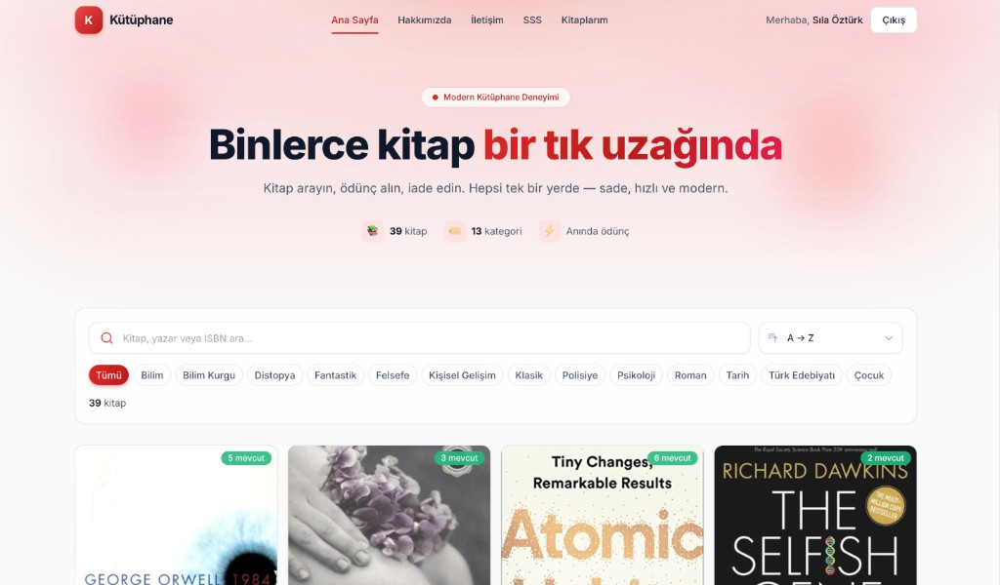
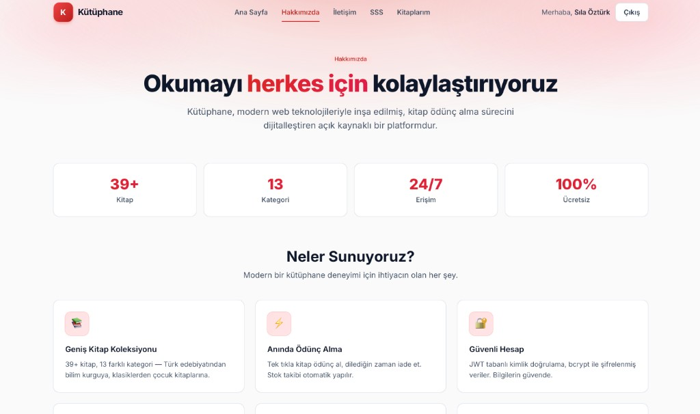
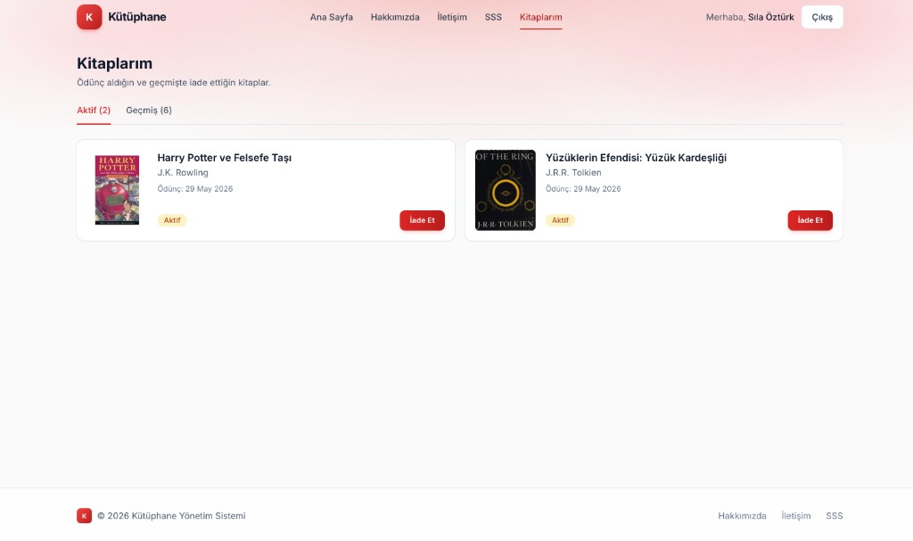
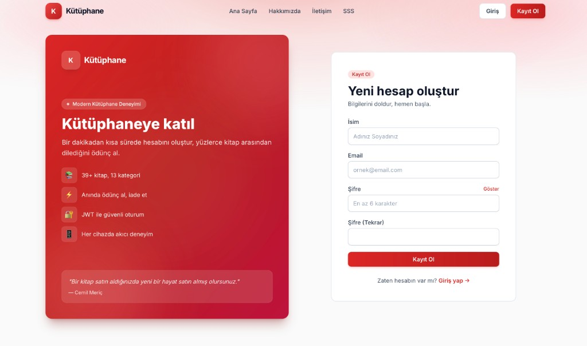

# Kütüphane Yönetim Sistemi

> Modern web teknolojileriyle geliştirilmiş, **MERN Stack** tabanlı tam fonksiyonlu bir kütüphane yönetim uygulaması.

Kullanıcılar kitapları görüntüler, ödünç alır ve iade eder. Yöneticiler ise kitapları ve ödünç kayıtlarını tek bir panelden yönetir.

---

<a id="genel-bakis"></a>
## Genel Bakış

Bu proje, bir kütüphanenin kitap envanteri ile ödünç alma süreçlerini dijitalleştiren, **rol tabanlı erişim** içeren bir web uygulamasıdır.

İki ana kullanıcı rolü vardır:

- **User (Üye)**: Kitapları görüntüler, ödünç alır ve iade eder.
- **Admin**: Tüm kullanıcı yetkilerine sahiptir; ek olarak kitap ekler/günceller/siler ve ödünç kayıtlarının tamamını görür.

---

<a id="ekran-goruntuleri"></a>

## Ekran Görüntüleri

### Anasayfa

Hero bölümü ve müsait kitapların grid görünümü.



### Hakkımızda

Misyon, istatistik kartları ve özellik vitrini.



### Kitaplarım

Kullanıcının aktif ve geçmiş ödünç kayıtları, sekmeli görünüm.



### Kayıt Ol

Sade ve ortalı kart tasarımı, şifre gücü göstergesi.



---

<a id="kullanilan-teknolojiler"></a>

## Kullanılan Teknolojiler

### Frontend

| Teknoloji          | Açıklama                                          |
| ------------------ | ------------------------------------------------- |
| **React 18**       | Bileşen tabanlı UI kütüphanesi                    |
| **Vite**           | Hızlı geliştirme sunucusu ve build aracı          |
| **React Router**   | Tek sayfa uygulama (SPA) yönlendirmesi            |
| **Tailwind CSS**   | Utility-first CSS framework + özel `brand` paleti |
| **Axios**          | HTTP istekleri (interceptor ile JWT yönetimi)     |
| **Context API**    | Global durum yönetimi (Auth)                      |
| **React Toastify** | Bildirim sistemi                                  |

### Backend

| Teknoloji                 | Açıklama                                |
| ------------------------- | --------------------------------------- |
| **Node.js + Express**     | RESTful API sunucusu                    |
| **MongoDB Atlas**         | Bulut tabanlı NoSQL veritabanı          |
| **Mongoose**              | MongoDB için ODM (şema doğrulama)       |
| **JWT (jsonwebtoken)**    | Token tabanlı kimlik doğrulama          |
| **bcryptjs**              | Şifre hashleme                          |
| **express-async-handler** | Async route'larda hata yönetimi         |
| **CORS, dotenv**          | Cross-origin desteği ve env yönetimi    |

---

<a id="ozellikler"></a>

## Özellikler

### Kullanıcı Tarafı

- Kayıt olma ve giriş yapma (form validasyonu, şifre gücü göstergesi)
- Müsait kitapları listeleme (ödünçte olanlar gizlenir)
- Kart üzerinden tek tıkla ödünç alma
- "Kitaplarım" sayfasında aktif ve geçmiş ödünç kayıtları
- İade etme

### Admin Paneli

- Yönetici özet istatistikleri (toplam kitap, müsait, aktif ödünç)
- Kitap **CRUD** işlemleri (modal üzerinden)
- Tüm ödünç kayıtlarını görüntüleme (kullanıcı + kitap bilgisi ile)

### Diğer Sayfalar

- **Hakkımızda**: Misyon, vizyon, istatistikler, özellikler

### Güvenlik & UX

- JWT token + Authorization header
- 401 yanıtında otomatik logout ve `/login` yönlendirmesi
- `ProtectedRoute` ile rol bazlı sayfa koruması
- Şifrelerin bcrypt ile hashlenerek saklanması
- Form validasyonları (frontend + Mongoose schema seviyesinde)
- Loading spinner'ları, toast bildirimleri, boş durum (empty state) tasarımları
- Tamamen **responsive** (mobil + tablet + masaüstü)

---

<a id="mimari-ve-klasor-yapisi"></a>

## Mimari ve Klasör Yapısı

```
web-programlama-proje/
├── backend/
│   ├── config/
│   │   └── db.js                    # MongoDB Atlas bağlantısı
│   ├── controllers/
│   │   ├── authController.js        # Kayıt, giriş, profil
│   │   ├── bookController.js        # Kitap CRUD
│   │   └── borrowController.js      # Ödünç alma/iade
│   ├── middleware/
│   │   ├── authMiddleware.js        # protect (JWT doğrulama)
│   │   ├── roleMiddleware.js        # adminOnly
│   │   └── errorMiddleware.js       # Global hata yakalayıcı
│   ├── models/
│   │   ├── User.js
│   │   ├── Book.js
│   │   └── Borrow.js
│   ├── routes/
│   │   ├── authRoutes.js
│   │   ├── bookRoutes.js
│   │   └── borrowRoutes.js
│   ├── utils/
│   │   ├── generateToken.js
│   │   └── seed.js                  # Test verilerini yükle
│   ├── .env                         # MONGO_URI, JWT_SECRET, PORT
│   └── server.js
│
└── frontend/
    ├── src/
    │   ├── api/
    │   │   └── axios.js             # JWT interceptor
    │   ├── components/
    │   │   ├── Navbar.jsx           # Scroll-trigger transparan header
    │   │   ├── Footer.jsx
    │   │   ├── BookCard.jsx
    │   │   ├── Modal.jsx
    │   │   ├── LoadingSpinner.jsx
    │   │   └── ProtectedRoute.jsx
    │   ├── context/
    │   │   └── AuthContext.jsx      # User + token
    │   ├── pages/
    │   │   ├── Home.jsx
    │   │   ├── Login.jsx
    │   │   ├── Register.jsx
    │   │   ├── MyBooks.jsx
    │   │   ├── AdminDashboard.jsx
    │   │   └── About.jsx
    │   ├── App.jsx
    │   └── index.css                # Tailwind + custom layer
    ├── tailwind.config.js           # brand (kırmızı) paleti
    ├── vite.config.js               # /api → :5001 proxy
    └── index.html
```

---

<a id="veri-modelleri"></a>

## Veri Modelleri

### User

| Alan       | Tip      | Notlar                                            |
| ---------- | -------- | ------------------------------------------------- |
| `name`     | String   | Zorunlu                                           |
| `email`    | String   | Zorunlu, benzersiz, lowercase                     |
| `password` | String   | bcrypt ile hashlenir (`pre('save')` hook)         |
| `role`     | String   | `user` veya `admin` (varsayılan: `user`)          |

### Book

| Alan              | Tip    | Notlar                                            |
| ----------------- | ------ | ------------------------------------------------- |
| `title`           | String | Zorunlu                                           |
| `author`          | String | Zorunlu                                           |
| `isbn`            | String | Benzersiz                                         |
| `description`     | String | Açıklama metni                                    |
| `coverImage`      | String | URL                                               |
| `availableCopies` | Number | 1 = müsait, 0 = ödünçte (her kitaptan tek kopya)  |

### Borrow

| Alan         | Tip      | Notlar                                  |
| ------------ | -------- | --------------------------------------- |
| `user`       | ObjectId | `User`'a referans                       |
| `book`       | ObjectId | `Book`'a referans                       |
| `borrowDate` | Date     | Otomatik (`Date.now`)                   |
| `returnDate` | Date     | İade edildiğinde set edilir             |
| `status`     | String   | `borrowed` \| `returned`                |

---

<a id="api-uc-noktalari"></a>

## API Uç Noktaları

> Base URL: `http://localhost:5001/api`

### Auth

| Method | Endpoint        | Erişim  | Açıklama                           |
| ------ | --------------- | ------- | ---------------------------------- |
| POST   | `/auth/register`| Public  | Yeni kullanıcı kaydı               |
| POST   | `/auth/login`   | Public  | Giriş ve JWT token döner           |
| GET    | `/auth/me`      | Private | Mevcut kullanıcı bilgisi           |

### Books

| Method | Endpoint     | Erişim | Açıklama                         |
| ------ | ------------ | ------ | -------------------------------- |
| GET    | `/books`     | Public | Tüm kitaplar                     |
| GET    | `/books/:id` | Public | Tek kitap detayı                 |
| POST   | `/books`     | Admin  | Yeni kitap ekle                  |
| PUT    | `/books/:id` | Admin  | Kitabı güncelle                  |
| DELETE | `/books/:id` | Admin  | Kitabı sil                       |

### Borrow

| Method | Endpoint              | Erişim  | Açıklama                              |
| ------ | --------------------- | ------- | ------------------------------------- |
| POST   | `/borrow`             | Private | Ödünç al                              |
| PUT    | `/borrow/return/:id`  | Private | İade et                               |
| GET    | `/borrow/my-books`    | Private | Kullanıcının kendi ödünçleri          |
| GET    | `/borrow/all`         | Admin   | Tüm ödünç kayıtları                   |

---

<a id="sayfalar"></a>

## Sayfalar

| Route             | Erişim     | Açıklama                                          |
| ----------------- | ---------- | ------------------------------------------------- |
| `/`               | Public     | Anasayfa (hero + müsait kitap kartları + ödünç al)|
| `/login`          | Public     | Giriş (ortalı kart tasarımı)                      |
| `/register`       | Public     | Kayıt (şifre gücü göstergesi)                     |
| `/my-books`       | Private    | Kullanıcının ödünç aldığı kitaplar                |
| `/admin`          | Admin Only | Yönetim paneli (Kitap / Ödünç sekmeleri)          |
| `/about`          | Public     | Hakkımızda                                        |

---

<a id="kurulum-ve-calistirma"></a>

## Kurulum ve Çalıştırma

### Ön Koşullar

- **Node.js** v18+
- **MongoDB Atlas** hesabı (veya lokal MongoDB)
- **npm** veya **yarn**

### 1. Repository'yi Klonla

```bash
git clone <repo-url>
cd web-programlama-proje
```

### 2. Backend Kurulumu

```bash
cd backend
npm install
```

`backend/.env` dosyasını oluştur:

```env
PORT=5001
MONGO_URI=mongodb+srv://<user>:<pass>@<cluster>.mongodb.net/library
JWT_SECRET=your_super_secret_key
JWT_EXPIRES_IN=7d
CLIENT_URL=http://localhost:5173
```

Test verilerini yükle (kullanıcılar + 12 kitap):

```bash
npm run seed
```

Backend'i başlat:

```bash
npm run dev
# → Sunucu http://localhost:5001 üzerinde çalışır
```

### 3. Frontend Kurulumu

```bash
cd ../frontend
npm install
npm run dev
# → Uygulama http://localhost:5173 üzerinde açılır
```

Vite'ın proxy ayarı sayesinde `/api/*` istekleri otomatik olarak backend'e yönlendirilir.

---

<a id="test-hesaplari"></a>

## Test Hesapları

`npm run seed` komutu ile aşağıdaki test hesapları oluşturulur:

| Rol       | Email                  | Şifre      |
| --------- | ---------------------- | ---------- |
| **Admin** | `admin@library.com`    | `admin123` |
| **User**  | `user@library.com`     | `user123`  |

---

<a id="tasarim-notlari"></a>

## Tasarım Notları

- **Renk paleti**: Tailwind config'te tanımlı özel `brand` (kırmızı) tonları (50–950).
- **Arka plan**: `body` için yumuşak bir radial gradient (kırmızı → beyaz).
- **Header**: Scroll'a duyarlı; başlangıçta transparan, kaydırınca beyaz blur + shadow alır.
- **Hero**: Bloksuz fluid tasarım, animasyonlu badge ve gradient yazılar.
- **Login / Register**: Sade, ortalanmış kart tasarımı.
- **Admin Panel**: Sekmeli arayüz (Kitaplar / Ödünç Kayıtları).
- **Mobil-first**: Tüm sayfalar Tailwind responsive utility'leri ile uyarlandı.

---

## Lisans

Bu proje akademik amaçlı geliştirilmiş bir öğrenci projesidir.
